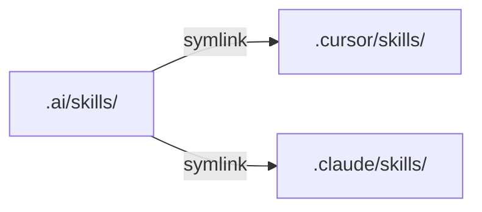

# `.ai/` — Shared AI Skills

Single source of truth for agent skills used by **Cursor** and **Claude Code**.

## How it works



Both tools resolve their expected paths through symlinks, so every skill is defined once and visible everywhere.

## Directory layout

```
.ai/
└── skills/
    ├── check/SKILL.md
    ├── insight-backend-flow-doc-update/SKILL.md
    ├── pr-cleanup/SKILL.md
    ├── pr-description/SKILL.md
    └── session-learnings/SKILL.md

.cursor/skills  →  ../.ai/skills   (symlink)
.claude/skills  →  ../.ai/skills   (symlink)
```

## Adding a skill

```bash
mkdir .ai/skills/my-skill
# Create SKILL.md with frontmatter (name, description) and instructions
```

It will appear in both Cursor and Claude Code automatically — no extra steps.

## Removing a skill

Delete the folder from `.ai/skills/`. Both symlinks reflect the change immediately.
