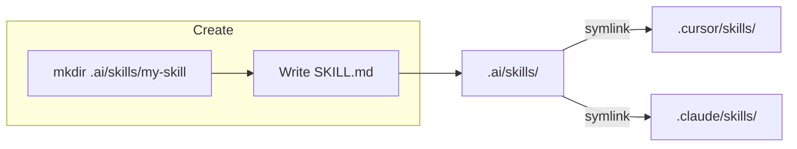
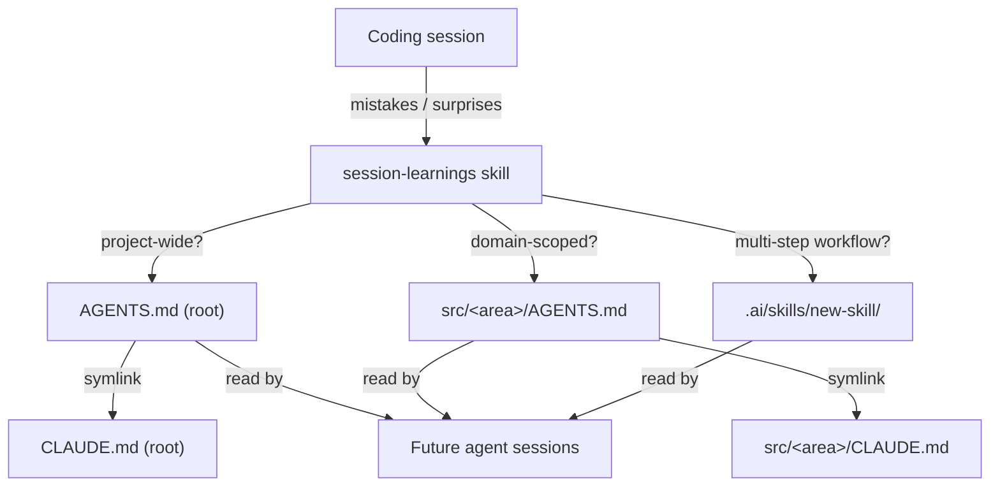

# `.ai/` — Shared AI Skills

Single source of truth for agent skills used by **Cursor** and **Claude Code**.

## How it works



Both tools resolve their expected paths through symlinks, so every skill is defined once and visible everywhere.

## Directory layout

```
.ai/
└── skills/
    ├── check/SKILL.md
    ├── create-skill/SKILL.md
    ├── insight-backend-flow-doc-update/SKILL.md
    ├── pr-cleanup/SKILL.md
    ├── pr-description/SKILL.md
    └── session-learnings/SKILL.md

.cursor/skills  →  ../.ai/skills   (symlink)
.claude/skills  →  ../.ai/skills   (symlink)
```

## Adding a skill

Use the **create-skill** skill, or manually:

```bash
mkdir .ai/skills/my-skill
```

Then create `SKILL.md` with frontmatter (`name`, `description`) and step-by-step instructions. See `create-skill/SKILL.md` for the full template and guidelines.

It will appear in both Cursor and Claude Code automatically — no extra steps.

## Removing a skill

Delete the folder from `.ai/skills/`. Both symlinks reflect the change immediately.

## AGENTS.md — codebase context

`AGENTS.md` files are the persistent memory that agents read at the start of every session. They capture project-specific knowledge that agents can't infer from code alone.



### How it works

The **session-learnings** skill is responsible for maintaining `AGENTS.md` files. At the end of a session (or when asked), it:

1. Reviews the conversation for pitfalls, conventions, and tooling surprises.
2. Filters out anything already enforced by linters or type checkers.
3. Writes the learning to the narrowest relevant scope.

Each `AGENTS.md` has a `CLAUDE.md` symlink next to it so Claude Code reads the same content.

### Placement rules

| Scope               | File                         | Example                                      |
| ------------------- | ---------------------------- | -------------------------------------------- |
| Project-wide        | `AGENTS.md` (root)           | Linting config, routing, deploy              |
| Domain-scoped       | `src/<area>/AGENTS.md`       | `src/inngest/AGENTS.md` for inngest patterns |
| Multi-step workflow | `.ai/skills/<name>/SKILL.md` | Reusable process with decision points        |

Subdirectory `AGENTS.md` files **only** live at the first level under `src/`. Never deeper (e.g. not `src/inngest/importers/AGENTS.md`). If a learning is specific to a sub-area, it goes in the nearest top-level parent's file.

### Current files

```
AGENTS.md              ← project-wide (linting, route generation)
CLAUDE.md              → AGENTS.md (symlink)

src/inngest/AGENTS.md  ← inngest-specific patterns
src/inngest/CLAUDE.md  → AGENTS.md (symlink)
```
