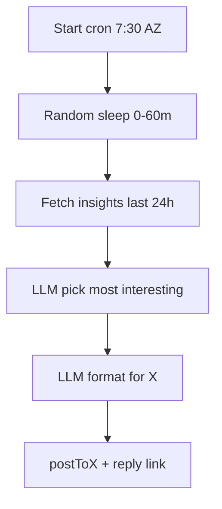

# Daily X Post Workflow

## What we’ll do

- Build a new Inngest function in [`src/inngest/post-to-x/daily-x-post.ts`](src/inngest/post-to-x/daily-x-post.ts) that runs on `TZ=America/Phoenix 30 7 * * *`, then applies a random 0–60 minute `step.sleep` jitter so the post lands between 7:30–8:30 AM AZ.
- Within the workflow, query Drizzle (`db.query.insights`) for insights created in the last 24h where `insight` is not null; exit early if none.
- Use OpenAI (mirroring the `get-summary` helper style) to:
- Pick the most interesting insight from that list (returning an insight id)
- Convert the chosen insight text into X-friendly formatting while preserving content and keeping it tweet-length. Using separate OpenAi call.
- Post via `postToX` from [`src/lib/post-to-x.ts`](src/lib/post-to-x.ts), replying with a link like `https://expert-system.starmode.dev/insight/{id}` for context.
- Register the new function in [`src/inngest/index.ts`](src/inngest/index.ts) so it deploys with the rest.

## Flow (mermaid)

