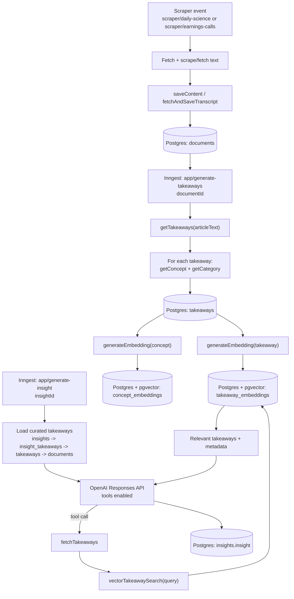

# Insight generation: backend data flow

This doc describes the **backend-only** pipeline that turns raw documents into generated insights.

## High-level stages

1. **Document ingestion** (scrape/fetch → persist `documents`)
2. **Takeaway generation** (LLM summaries) + **concept generation** (LLM concept label) + **categorization**
3. **Vector DB + search** (embed takeaways/concepts → store in Postgres `pgvector` → cosine similarity search)
4. **Insight generation** (compose an insight from selected takeaways, optionally pulling more via vector search)

---

## Stage 1: Document ingestion

**Goal**: Get raw text into the database as a `documents` row.

### Inputs

- **Scraper events** (Inngest):
  - `scraper/daily-science` → RSS + HTML scrape
  - `scraper/earnings-calls` → AlphaVantage transcript fetch

### Processing

- Scrapers normalize scraped content into a `Document` shape and persist it via:
  - `saveContent(document)` → inserts into `documents`
  - `fetchAndSaveTranscript(...)` → fetches transcript → dedupes by `(source, title)` → calls `saveContent`

### Output (storage)

- `documents` table
  - Key fields used downstream:
    - `documents.id`
    - `documents.articleText` (the raw text input for LLM summarization)
    - `documents.source`, `documents.publicationDate`, `documents.title`

### What triggers the next stage

- After a `documentId` is created, scrapers trigger takeaway generation by emitting:
  - event `app/generate-takeaways` with `data.documentId` (and prompt/model settings)

---

## Stage 2: Takeaway generation (including concepts)

**Goal**: Turn one document into multiple structured takeaways, each with a concept and category, and persist them.

### Input

- `documentId` from `documents`

### Processing (Inngest function: `app/generate-takeaways`)

- **Repeat guard**: checks for existing `takeaways` rows for the `documentId`; if any exist, it exits early
- **LLM takeaway extraction**:
  - loads `documents.articleText`
  - calls `getTakeaways(articleText, takeawayPrompt, model)`
- **LLM concept generation** (per takeaway):
  - calls `getConcept(takeaway.takeaway)` and stores `concept.concept` on the takeaway
- **LLM categorization** (per takeaway):
  - calls `getCategory(takeaway.takeaway)` and stores `categoryId`
- **Persistence**:
  - deletes any existing takeaways for the document (defensive cleanup)
  - inserts new rows into `takeaways`

### Output (storage)

- `takeaways` table (one row per takeaway)
  - Key fields used downstream:
    - `takeaways.id`
    - `takeaways.takeaway` (the summary text that gets embedded and used as context)
    - `takeaways.concept` (a short concept label that also gets embedded)
    - `takeaways.categoryId`
    - `takeaways.documentId` (join back to raw document metadata/text)

---

## Stage 3: Vector DB and search

**Goal**: Make takeaways (and their concepts) searchable by semantic similarity.

### “Vector DB” in this repo

- **Postgres + `pgvector`** columns managed via Drizzle
- Two embedding tables (each has an HNSW index for approximate nearest neighbor search):
  - `takeaway_embeddings.embedding` (`vector(1536)`)
  - `concept_embeddings.embedding` (`vector(1536)`)

### Embedding write path (part of Stage 2)

After each `takeaways` row is inserted, the pipeline:

- calls `generateEmbedding(takeaway.takeaway)` and upserts into `takeaway_embeddings`
- calls `generateEmbedding(takeaway.concept)` and upserts into `concept_embeddings`

Notes:

- Embeddings are generated with OpenAI model `text-embedding-3-small`
- Embeddings are stored with a unique `takeawayId` so they can be joined back to the canonical takeaway row

### Search/read path (used during insight generation and search features)

- Query embedding:
  - `generateEmbedding(searchInput)`
- Vector similarity query:
  - `vectorTakeawaySearch(searchInput, limit)`:
    - computes cosine distance against `takeaway_embeddings.embedding`
    - filters for similarity > 0.2
    - returns takeaways joined with `document` + `category`
  - `vectorConceptSearch(searchInput, limit)`:
    - searches `concept_embeddings.embedding`
    - returns takeaways joined with `document` + `category`

---

## Stage 4: Insight generation

**Goal**: Generate a detailed insight from a curated set of takeaways, with the ability to pull in more context via vector search.

### Input

- `insightId` (an `insights` row that is connected to takeaways via the join table)
- `insightPrompt` (user-provided extra instruction)
- optional `model`

### Processing (Inngest function: `app/generate-insight`)

- Loads the insight and its curated takeaways via joins:
  - `insights` → `insight_takeaways` → `takeaways` → `documents`
- Builds the initial prompt containing:
  - takeaway titles, source, publication date, and takeaway text
- Calls the OpenAI Responses API with:
  - `tools: insightTools`
  - `tool_choice: "auto"`
- Tool loop:
  - If the model requests a tool call, the backend executes it and feeds results back into the conversation
  - The primary tool is:
    - `fetchTakeaways({ query, timeWeighted })` → uses `vectorTakeawaySearch(query, 10)` and optionally reweights by recency
- Terminates when there are no more tool calls
- Persists the final result:
  - updates `insights.insight` with the generated text

### Output (storage)

- `insights.insight` (final generated insight text)

---

## End-to-end diagram (backend)

---

## Quick “where to look in code”

- **Ingestion**
  - `src/inngest/functions/science-daily-scraper.ts`
  - `src/inngest/functions/earnings-calls-scraper.ts`
  - `src/inngest/steps/scrapers/save-content.ts`
- **Takeaways + concepts + categorization**
  - `src/inngest/functions/generate-takeaways.ts`
  - `src/lib/ai-helpers/get-takeaways.ts`
  - `src/lib/ai-helpers/generate-concept.ts`
  - `src/lib/ai-helpers/get-category.ts`
- **Vector DB + embedding + search**
  - `src/postgres/schema.ts` (pgvector tables + HNSW indexes)
  - `src/postgres/generate-embedding.ts`
  - `src/server/vector-queries.ts`
- **Insight generation**
  - `src/inngest/functions/generate-insight.ts`
  - `src/lib/ai-helpers/tools/tools.ts`
  - `src/lib/ai-helpers/tools/tool-handling.ts`
