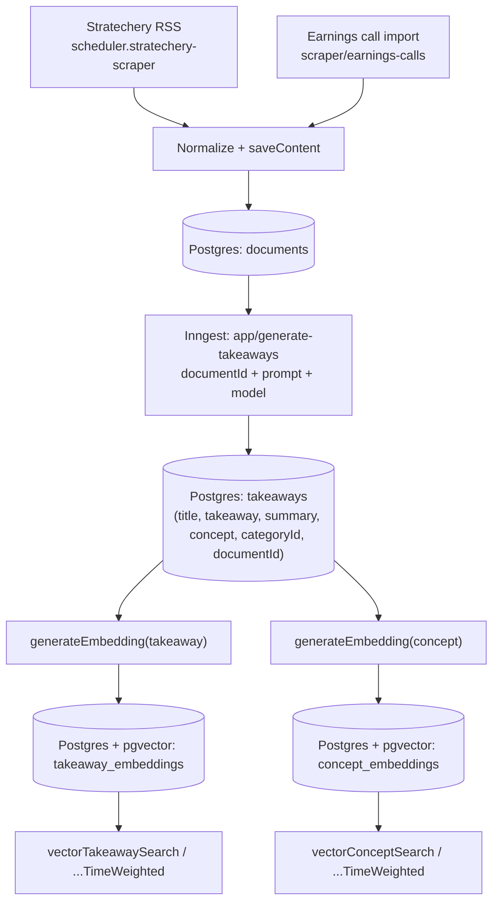
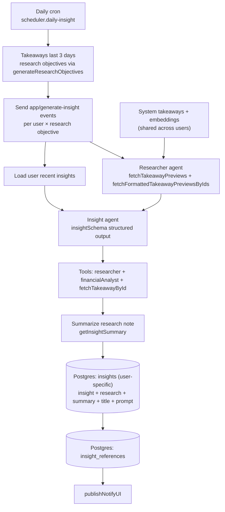

# Insight generation: backend data flow

This doc describes the backend pipelines that turn raw documents into shared takeaways and user-specific insights.

## Flows at a glance

- System-wide takeaways: ingest documents → generate takeaways with concepts/categories → embed into pgvector for semantic search.
- User-specific insights: scheduled or ad-hoc insight generation per user, seeded from recent takeaways and vector search.
- Takeaways are shared across all users; insights are always tied to a single user.

---

## System-wide takeaways pipeline

### Stage 1: Document ingestion

**Goal**: Get raw text into the database as a `documents` row.

**Inputs**

- **Scraper/ingester events** (Inngest):
  - `scheduler.stratechery-scraper` → Stratechery RSS fetch (daily cron)
  - `scheduler.dwarkesh-podcast-scraper` → Dwarkesh Podcast RSS + transcript fetch (daily 5 AM Phoenix)
  - `scheduler.macrovoices-scraper` → MacroVoices transcript landing page scrape (daily 5 AM Phoenix)
  - `scheduler.fed-speeches-scraper` → Federal Reserve speeches + testimony RSS scrape (daily 6:15 AM Phoenix)
  - `scheduler.sync-earnings-calendar` → Weekly Alpha Vantage earnings calendar sync that seeds fetch jobs for tracked symbols
  - `scheduler.process-earnings-jobs` → Daily runner that turns pending earnings fetch jobs into transcripts
  - `scraper/earnings-calls` → Ad-hoc Alpha Vantage transcript fetch (manual/triggered with symbol + quarter)

**Processing**

- Scrapers normalize scraped content into a `Document` shape and persist via:
  - `saveContent(document)` → inserts into `documents`
  - `fetchAndSaveTranscript(...)` → fetches transcript → dedupes by `(source, title)` → calls `saveContent`

**Output (storage)**

- `documents` table
  - Key fields used downstream:
    - `documents.id`
    - `documents.articleText` (the raw text input for LLM summarization)
    - `documents.source`, `documents.publicationDate`, `documents.title`

**What triggers the next stage**

- After a `documentId` is created, scrapers trigger takeaway generation by emitting:
  - event `app/generate-takeaways` with `data.documentId` (and prompt/model settings)

### Stage 2: Takeaway generation (including concepts)

**Goal**: Turn one document into multiple structured takeaways, each with a concept and category, and persist them.

**Input**

- `documentId` from `documents`

**Processing (Inngest function: `app/generate-takeaways`)**

- **Repeat guard**: exits early if takeaways already exist for the `documentId`
- **LLM takeaway extraction**:
  - loads `documents.articleText`
  - calls `getTakeaways(articleText, takeawayPrompt, model)`
- **LLM concept generation** (per takeaway):
  - calls `getConcept(takeaway.takeaway)` and stores `concept.concept` on the takeaway
- **LLM categorization** (per takeaway):
  - calls `getCategory(takeaway.takeaway)` and stores `categoryId`
- **Persistence**:
  - deletes any existing takeaways for the document (defensive cleanup)
  - inserts new rows into `takeaways`
  - generates embeddings for the takeaway text and concept and upserts into `takeaway_embeddings` and `concept_embeddings`

**Output (storage)**

- `takeaways` table (one row per takeaway)
  - Key fields used downstream:
    - `takeaways.id`
    - `takeaways.title`
    - `takeaways.takeaway` (full text)
    - `takeaways.summary` (shorter preview text)
    - `takeaways.concept` (short concept label)
    - `takeaways.categoryId`
    - `takeaways.documentId` (join back to raw document metadata/text)

### Stage 3: Embeddings + vector search

**Goal**: Make takeaways (and their concepts) searchable by semantic similarity across the system.

**“Vector DB” in this repo**

- **Postgres + `pgvector`** columns managed via Drizzle
- Two embedding tables (each has an HNSW index for approximate nearest neighbor search):
  - `takeaway_embeddings.embedding` (`vector(1536)`)
  - `concept_embeddings.embedding` (`vector(1536)`)

**Search/read path**

- Query embedding:
  - `generateEmbedding(searchInput)`
- Vector similarity queries:
  - `vectorTakeawaySearch(searchInput, limit)` and `vectorTakeawaySearchTimeWeighted(...)`
  - `vectorConceptSearch(searchInput, limit)` and `vectorConceptSearchTimeWeighted(...)`
  - Both return takeaways joined with `document` + `category`

### System-wide flow diagram

---

## User-specific insight pipeline

### Inputs / triggers

- `app/generate-insight` events supply `insightPrompt` and the target user.
- **Daily automation** (`scheduler.daily-insight`, cron `TZ=America/Phoenix 0 7 * * *`):
  - Fetches takeaways created in the last 3 days (system-wide).
  - Generates research objectives from the takeaway summaries via `generateResearchObjectives` (OpenAI Responses structured output).
- Fans out `app/generate-insight` events per user × selected research objective.
- Current daily runner only sends the third objective (`insightPrompts.slice(2, 3)`).
- Current daily runner targets `spencer@starmode.app` only (single-user run).

### Processing (Inngest function: `app/generate-insight`)

- Load the user’s recent insights (last 15) to avoid duplication in the prompt.
- Run the **researcher agent** to expand context:
  - Uses `fetchTakeawayPreviews` (time-weighted vector search) to find relevant takeaways.
  - Uses `fetchFormattedTakeawayPreviewsByIds` to return formatted takeaway previews.
- Run the **insight agent** with:
  - Context: formatted takeaway previews + recent insights + `insightPrompt`
  - Tools:
    - `researcher` (the same sub-agent for additional takeaway retrieval)
    - `financialAnalyst` (Alpha Vantage-backed financial data tools)
    - `fetchTakeawayById` (full takeaway text + references)
  - Structured output enforced by `insightSchema`
- Summarize the research note into a user-facing post via `getInsightSummary` (OpenAI Responses structured output).
- Persist:
  - `insights` row with `title`, `insight` (summary post), `research` (raw research note), `summary` (core insight statement), and `insightPrompt`
  - `insight_references` (deduped references mapped to insight reference numbers)
  - `insight_takeaways` is currently not written (commented out)
- Notify the UI when the insight is generated.

**Output (storage)**

- `insights.insight` (summary post), `insights.summary` (core statement), and `insights.research` (research note), keyed by `insights.userId` (user-specific)

### User-specific flow diagram

---

## Quick “where to look in code”

- **Ingestion**
  - `src/inngest/importers/scheduled/stratechery.ts`
  - `src/inngest/importers/earnings-calls-scraper.ts`
  - `src/inngest/importers/scrapers/save-content.ts`
- **Takeaways + concepts + categorization**
  - `src/inngest/takeaways/generate-takeaways.ts`
  - `src/inngest/takeaways/helpers/get-takeaways.ts`
  - `src/inngest/takeaways/helpers/generate-concept.ts`
  - `src/inngest/takeaways/helpers/get-category.ts`
- **Vector DB + embedding + search**
  - `src/postgres/schema.ts` (pgvector tables + HNSW indexes)
  - `src/postgres/generate-embedding.ts`
  - `src/server/vector-queries.ts`
- **Insights (user-specific)**
  - `src/inngest/insights/daily-insight.ts`
  - `src/inngest/insights/generate-insight.ts`
  - `src/inngest/insights/helpers/get-insight-summary.ts`
  - `src/inngest/insights/agents/insight-agent.ts`
  - `src/inngest/insights/agents/researcher.ts`
  - `src/inngest/insights/agents/financial-analyst.ts`
  - `src/inngest/insights/insight-prompts.ts`
  - `src/inngest/insights/tool-functions/tools-takeaways.ts`
